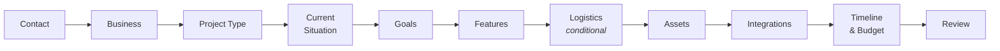

# imoyinsampson.com

Personal site and portfolio for **Imoyin Sampson** — software engineer, product architect, and co-founder at App Guts, building from Port Harcourt, Nigeria.

Beyond the usual portfolio pages, the site runs a multi-step **project discovery wizard** that qualifies inbound client work and delivers the brief — with attachments — straight to the inbox.

**Live:** <https://imoyinsampson.com>


---

## Contents

- [Pages](#pages)
- [Tech stack](#tech-stack)
- [Getting started](#getting-started)
- [Environment variables](#environment-variables)
- [Project structure](#project-structure)
- [The project discovery wizard](#the-project-discovery-wizard)
- [Contact form](#contact-form)
- [SEO and metadata](#seo-and-metadata)
- [Security headers](#security-headers)
- [Deployment](#deployment)

---

## Pages

| Route | Purpose |
| --- | --- |
| `/` | Home — hero, what I build, featured ventures, trusted-by, insights preview, CTA |
| `/about` | Background and story |
| `/ventures` | Companies and products |
| `/technology` | Engineering practice and stack |
| `/insights` | Writing index |
| `/insights/[slug]` | Individual article |
| `/speaking` | Talks and appearances |
| `/music` | Saxophone and musical work |
| `/work-with-me` | Engagement models |
| `/project-discovery` | Multi-step client intake wizard |
| `/contact` | Direct contact form |
| `/privacy` | Privacy policy |

### Writing

Articles live in `lib/articles.tsx` as typed data rather than in a CMS or markdown files. Current pieces:

- Why African developers need to think in products, not just code
- What building App Guts actually taught me
- On being an engineer and an artist without apology
- The hardest part of building a team isn't hiring
- EventsKona: why I built a product nobody asked me to build
- What jazz taught me about building software

Adding an article means adding an entry to that file; `/insights/[slug]` picks it up through `getArticle(slug)`.

---

## Tech stack

| Concern | Choice |
| --- | --- |
| Framework | Next.js 16 (App Router) |
| UI | React 19 |
| Language | TypeScript 5 |
| Styling | Tailwind CSS 4 |
| Icons | `lucide-react` |
| Email | [Resend](https://resend.com) |
| Fonts | Cormorant Garamond (display), Inter (body), JetBrains Mono (code) — self-hosted via `next/font` |
| Images | `next/image`, with Cloudinary and Unsplash allowed as remote sources |

---

## Getting started

### Prerequisites

- Node.js 18.18 or later
- npm

### Installation

```bash
git clone https://github.com/imostack/imoyin.git
cd imoyin
npm install
npm run dev
```

The site runs at <http://localhost:3000>.

### Scripts

| Script | What it does |
| --- | --- |
| `npm run dev` | Development server |
| `npm run build` | Production build |
| `npm run start` | Serve the production build |
| `npm run lint` | ESLint |

---

## Environment variables

Create `.env.local`:

```bash
RESEND_API_KEY=re_your_key_here
```

| Variable | Required | Purpose |
| --- | --- | --- |
| `RESEND_API_KEY` | For both form endpoints | Authenticates with Resend |

Pages render without it; `POST /api/contact` and `POST /api/project-discovery` will not.

Mail flows from `contact@imoyinsampson.com` to `hello@imoyinsampson.com`, with `replyTo` set to the sender — so replying from the inbox reaches them directly. The domain must be verified in Resend.

> `.env.local` is gitignored and must stay that way — it holds a live API key.

---

## Project structure

```text
app/
├── layout.tsx                    # Fonts, metadata, Navbar, Footer
├── page.tsx                      # Home
├── globals.css
├── icon.tsx                      # Generated favicon
├── opengraph-image.tsx           # Generated OG image
├── robots.ts  sitemap.ts         # Generated SEO files
├── about/  ventures/  technology/
├── speaking/  music/  work-with-me/  privacy/
├── insights/  insights/[slug]/
├── contact/
├── project-discovery/
└── api/
    ├── contact/route.ts
    └── project-discovery/route.ts

components/
├── layout/       # Navbar, Footer
├── home/         # Hero, WhatIBuild, FeaturedVentures, TrustedBy,
│                 # InsightsPreview, CTAStrip
├── contact/      # ContactForm
├── project-discovery/
│   ├── ProjectDiscoveryWizard.tsx
│   ├── steps/    # One component per wizard step
│   ├── FileDropzone.tsx  ProgressBar.tsx  SuccessScreen.tsx
│   ├── fields.tsx        # Shared form controls
│   └── types.ts
└── ui/           # AnimatedSection, SocialIcons

hooks/
├── useInView.ts   # Scroll-triggered animation
└── useScrolled.ts # Navbar state on scroll

lib/
├── articles.tsx           # Article content and lookup
└── project-discovery.ts   # Step definitions, validation, upload limits
```

---

## The project discovery wizard

`/project-discovery` walks a prospective client through eleven steps, validating as it goes and submitting everything — including uploaded files — in a single request.



**Conditional steps.** The Logistics step only appears when the project type calls for it (`isLogisticsProject`), so respondents are not asked irrelevant questions.

**Validation.** Contact, Business, Project Type, Goals, and Timeline & Budget each have a validator that must pass before the wizard advances. The remaining steps are optional.

**File uploads.** `FileDropzone` accepts supporting documents, enforced both client- and server-side:

| Limit | Value |
| --- | --- |
| Maximum files | 6 |
| Per file | 8 MB |
| Combined total | 20 MB |

Exceeding any limit returns a `400` naming the offending file and the limit it broke. Valid submissions are emailed with the attachments included, and the user is shown `SuccessScreen`.

---

## Contact form

`/contact` is the short path for people who do not need the full wizard. `POST /api/contact` validates the payload and sends a single notification email with `replyTo` set to the sender's address.

---

## SEO and metadata

Handled through the App Router's file conventions:

- **`app/sitemap.ts`** and **`app/robots.ts`** generate `sitemap.xml` and `robots.txt` at build time
- **`app/opengraph-image.tsx`** and **`app/icon.tsx`** generate the social preview image and favicon
- **`layout.tsx`** sets `metadataBase`, a title template (`%s — Imoyin Sampson`), keywords, Open Graph, and Twitter card metadata

---

## Security headers

`next.config.ts` applies headers on every route:

| Header | Value |
| --- | --- |
| `X-Frame-Options` | `SAMEORIGIN` |
| `X-Content-Type-Options` | `nosniff` |
| `Content-Security-Policy` | Restrictive policy, production only |
| `X-Powered-By` | Removed (`poweredByHeader: false`) |

The CSP confines `default-src`, `connect-src`, and `font-src` to `'self'`, blocks `object-src` outright, and allows images only from `'self'`, `data:`, Cloudinary, and Unsplash.

Two deliberate trade-offs are documented in the config itself:

- **`script-src` permits `'unsafe-inline'`** because the App Router injects per-request inline scripts to stream RSC hydration data. Their content varies per request, so they cannot be pinned with a static hash — a hash- or nonce-only policy blocks them and breaks hydration silently, leaving the page rendered but inert.
- **The CSP is skipped in development**, since Turbopack's HMR runtime needs looser script rules than the production policy allows.

---

## Deployment

A standard Next.js app — deploys to [Vercel](https://vercel.com) with no configuration changes. Set `RESEND_API_KEY` in the project's environment variables first.

---

## License

No license has been specified. This is a personal site; the content and branding are not intended for reuse.
